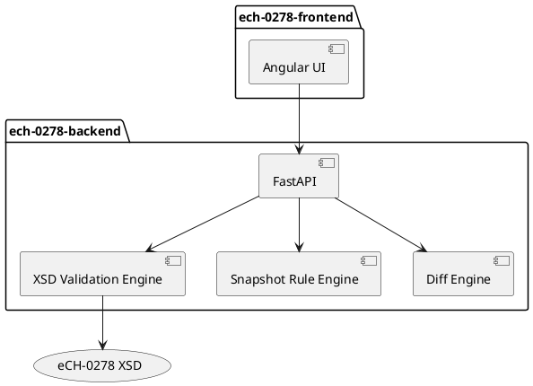
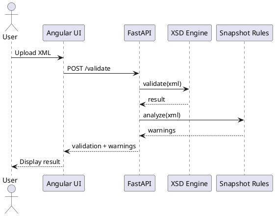

# eCH-0278 Architecture Explorer

## Concept v0.1 (Lifecycle Snapshot Assumption)

Status: Draft v0.1
Scope: Public Architecture Demonstrator for eCH-0278 (Draft 1.0.0)
Model Assumption: Phase-separated lifecycle snapshots (declaration OR taxation per document)

---

# 1. Purpose

The Architecture Explorer is not a tax filing UI.
It is a structural analysis tool for:

* Normative XSD structure exploration
* Lifecycle interpretation validation (snapshot assumption)
* Structural ambiguity detection
* Declaration vs Taxation delta analysis

The tool remains strictly aligned with the normative XSD as the single source of truth.

---

# 2. Lifecycle Assumption (v0.1)

For v0.1 the following conservative interpretation applies:

* A single XML document represents exactly one lifecycle phase.
* Phase ∈ {declaration, taxation}
* Mixed `taxProcedure` values inside one document are treated as structurally allowed but semantically ambiguous under snapshot interpretation.

This assumption may be revised if official clarification is provided.

---

# 3. Feature Scope v0.1

## 3.1 Schema Explorer

* Tree view of ComplexTypes and Elements
* Display of:

  * Cardinality
  * Type
  * Enumeration
  * Attribute groups
* Highlight usage of:

  * taxProcedureGroup
  * taxFactorGroup
  * taxCompetenceGroup

## 3.2 XML Validation

* Upload XML instance
* Validate against normative XSD
* Return:

  * XSD validity
  * Validation errors
  * Namespace summary

Additional (non-normative) analysis:

* Mixed taxProcedure detection
* Snapshot phase consistency warning

## 3.3 Snapshot Comparison (Declaration vs Taxation)

* Upload two XML files
* Validate both
* Generate delta summary:

  * Changed numeric values
  * Added/removed nodes
* Output high-level difference metrics

---

# 4. Architecture Overview

## 4.1 Logical Layers

1. Normative Layer (XSD)
2. Validation Layer (XSD validation)
3. Analysis Layer (Snapshot rules + diff engine)
4. Presentation Layer (Angular UI)

---

# 5. Component Diagram (PlantUML)



---

# 6. Validation Sequence (PlantUML)



---

# 7. Repository Structure

```
ech-0278/
  backend/
    app/
    schema/
  frontend/
  docs/
  infra/
```

---

# 8. Deployment Model

* Kubernetes Namespace: ech-0278
* Pods:

  * ech-0278-backend
  * ech-0278-frontend
* Ingress:

  * ech-0278.gap-labs.net

No persistent storage required.
XSD mounted as read-only configuration.

---

# 9. Success Criteria v0.1

* Schema navigation works
* XML validation works
* Snapshot warnings detected
* Delta comparison produces structured output
* Public deployment accessible under subdomain

---

End of Concept v0.1
